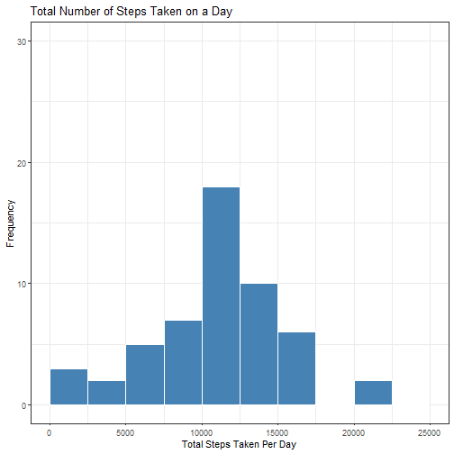
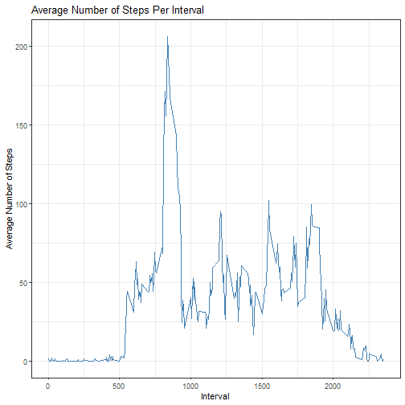
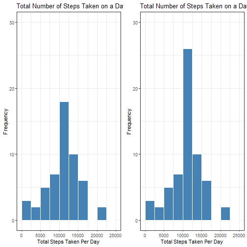
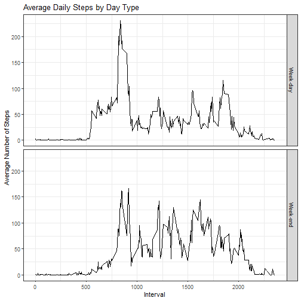

# COURSE PROJECT 1

For this project, we'll be using data collected by activity trackers. The data was collected during the months of October and November 2012. It is constituted by the number of steps the individual takes at a 5-minute interval.

To answer the exercise's problem, we're going to follow 5 steps, which will be described one by one afterwards.

## Question 1 : Loading and preprocessing data

In this first step, we will download the data and read it with read.csv().

But first, we'll load the different packages we'll be using for the project


```r
library(ggplot2)
library(dplyr)
library(xtable)
library(gridExtra)
```


```r
# Download the Data
url <- "https://d396qusza40orc.cloudfront.net/repdata%2Fdata%2Factivity.zip"
download.file(url, destfile = "data.zip")

# Unzipping the file and reading it
unzip("data.zip")
```


```r
# Read files
activity <- read.csv("activity.csv", sep = ",")
```

Now the data is in our working environment. We can take a first look at the data.


```r
summary(activity)
```

```
##      steps            date              interval     
##  Min.   :  0.00   Length:17568       Min.   :   0.0  
##  1st Qu.:  0.00   Class :character   1st Qu.: 588.8  
##  Median :  0.00   Mode  :character   Median :1177.5  
##  Mean   : 37.38                      Mean   :1177.5  
##  3rd Qu.: 12.00                      3rd Qu.:1766.2  
##  Max.   :806.00                      Max.   :2355.0  
##  NA's   :2304
```


```r
head(activity)
```

```
##   steps       date interval
## 1    NA 2012-10-01        0
## 2    NA 2012-10-01        5
## 3    NA 2012-10-01       10
## 4    NA 2012-10-01       15
## 5    NA 2012-10-01       20
## 6    NA 2012-10-01       25
```

At first glance, the data is composed of three columns/variables: steps, date, interval. The first column/variable - steps has missing values. The second column/variable - date is a date, but still in character.

For the next step, we'll transform the date format from character to date.


```r
activity$date <- as.POSIXct(activity$date)
```

## Question 2 : What is mean total of steps taken per day ?

For this part of the assignment, you can ignore the missing values in the dataset.

1.  We'll calculate the total number of steps taken per day


```r
sum.step.day <- activity %>% 
        na.omit(activity) %>% 
        group_by(date) %>% 
        summarise(steps.sum = sum(steps))
head(sum.step.day,3)
```

```
## # A tibble: 3 × 2
##   date                steps.sum
##   <dttm>                  <int>
## 1 2012-10-02 00:00:00       126
## 2 2012-10-03 00:00:00     11352
## 3 2012-10-04 00:00:00     12116
```

2.  We'll make a histogram of the total number of steps taken each day


```r
base_plot <- ggplot(sum.step.day, aes(x = steps.sum))
plot_hist <- base_plot + geom_histogram(breaks = seq(0, 25000, by = 2500),fill = "steelblue", col = "white") +
        xlab("Total Steps Taken Per Day") + ylab("Frequency") +
        ylim(0, 30) +
        ggtitle("Total Number of Steps Taken on a Day") +
        theme_bw()
print(plot_hist)
```



3.  Now, we'll calculate the mean and the median

The mean of the total number of steps taken per day is below.


```r
mean(sum.step.day$steps.sum)   
```

```
## [1] 10766.19
```

And, the median of the total number of steps taken per day is below.


```r
median(sum.step.day$steps.sum)
```

```
## [1] 10765
```

## Question 3 : What is the average daily activity pattern ?

For this steps, we'll make a time series plot of the 5 minute interval and the average number of steps taken.

So first, we have to calculate the average of steps taken in each 5 minute interval


```r
mean.step.inter <- activity %>% 
        na.omit(activity) %>% 
        group_by(interval) %>% 
        summarise(mean.steps = mean(steps))
head(mean.step.inter, 3)
```

```
## # A tibble: 3 × 2
##   interval mean.steps
##      <int>      <dbl>
## 1        0      1.72 
## 2        5      0.340
## 3       10      0.132
```

Now we can make the plot.


```r
base_mean.step.inter <- ggplot(mean.step.inter, aes(interval, mean.steps))
base_mean.step.inter + geom_line( color = "steelblue") +
        ggtitle("Average Number of Steps Per Interval") +
        xlab("Interval") + ylab("Average Number of Steps") +
        theme_bw()
```



Now we'll see at which time interval, or more precisely at which time of day, the maximum number of steps occurs.


```r
mean.step.inter %>% 
        filter(mean.steps == max(mean.step.inter$mean.steps))
```

```
## # A tibble: 1 × 2
##   interval mean.steps
##      <int>      <dbl>
## 1      835       206.
```

The maximum number of steps was found at interval **"835"**, i.e. around **"1:55 pm"**, with an average number of steps of **"206"**.

## Question 4 : Imputing missing values

As we saw in the first part of this work, the steps column/variable has missing values. In this section, we'll fill in the missing values.

1.  we'll calculate the total number of missing value in the data


```r
sum(is.na(activity$steps))
```

```
## [1] 2304
```

Now we can see that we have **"2304"** missing value in steps.

2.  We'll fill these missing value with the average steps in the interval


```r
activity.oa <-  as.data.frame(activity)
for (i in 1:17568) {
        if (is.na(activity.oa$steps[i])) {
                activity.oa[i, 1] <- mean.step.inter[mean.step.inter$interval == activity.oa$interval[i], 2]   
        } else {
                
        }
}
head(activity.oa)
```

```
##       steps       date interval
## 1 1.7169811 2012-10-01        0
## 2 0.3396226 2012-10-01        5
## 3 0.1320755 2012-10-01       10
## 4 0.1509434 2012-10-01       15
## 5 0.0754717 2012-10-01       20
## 6 2.0943396 2012-10-01       25
```

3.  Histogram of the total number of steps taken each day

-   We'll calculate the total number of steps taken per day with new data


```r
sum.step.day.o.na <- activity.oa %>% 
        group_by(date) %>% 
        summarise(sum.step = sum(steps))
head(sum.step.day.o.na)
```

```
## # A tibble: 6 × 2
##   date                sum.step
##   <dttm>                 <dbl>
## 1 2012-10-01 00:00:00   10766.
## 2 2012-10-02 00:00:00     126 
## 3 2012-10-03 00:00:00   11352 
## 4 2012-10-04 00:00:00   12116 
## 5 2012-10-05 00:00:00   13294 
## 6 2012-10-06 00:00:00   15420
```

-   Histogram


```r
plot4 <- ggplot(sum.step.day.o.na, aes(x = sum.step))
plot_hist2 <- plot4 + geom_histogram(breaks = seq(0, 25000, 2500),fill = "steelblue", col = "white") +
        xlab("Total Steps Taken Per Day") + ylab("Frequency") +
        ylim(0, 30) +
        ggtitle("Total Number of Steps Taken on a Day (na compute)") +
        theme_bw()
print(plot_hist2) 
```


-   Calculate Mean an Median

The mean of the total number of steps taken per day for the new data is below.


```r
mean(sum.step.day.o.na$sum.step)
```

```
## [1] 10766.19
```

And, the median of the total number of steps taken per day for the new is below.


```r
median(sum.step.day.o.na$sum.step)
```

```
## [1] 10766.19
```

The values of the two data sets are very similar, if not exactly the same, due to the use of averaging functions when imputing the NA measurements. The mean values are the same, at **10766.19** steps, while the median value is slightly larger for the imputed data set, at **10766.19** steps, rather than **10765** steps.

-   Histogram of the two data


```r
grid.arrange(plot_hist, plot_hist2, ncol = 2)
```



It can be seen that the frequency of values increases in the second histogram, which is expected, due to the imputed values.

More explanations for the differences between the non and imputed data sets can be seen by looking at the NA values grouped by their date variable.

## Question 5 : Differences in activity patterns between weekdays and weekens

To start with, we're going to add a new column that will be a two-level factorial variable: week - day and week-end.


```r
# Add new col with weekday()
activity.oa <- activity.oa %>% 
        mutate(day = weekdays(activity.oa$date))

## Convert weekday to day.type
weekend_day <- c("samedi", "dimanche")
for (i in 1:nrow(activity.oa)) {
        if (activity.oa$day[i] %in% weekend_day) {
                activity.oa$day.type[i] <- "Week-end"
        } else {
                activity.oa$day.type[i] <- "Week-day"        
        }
}
```

Now we can make a panel plot containing a times series plot of the 5 - minute interval and the average number of steps taken, average across all weekday days or weekend days.


```r
## group the data by day.type
gp.by.day.type <- activity.oa %>% 
        group_by(day.type, interval) %>% 
        summarise(mean.step = mean(steps))
```

```
## `summarise()` has grouped output by 'day.type'. You can override using the
## `.groups` argument.
```

```r
day.type_plot <- ggplot(gp.by.day.type, aes(x = interval, y = mean.step)) 
day.type_plot + geom_line()+
        facet_grid(gp.by.day.type$day.type~.) +
        xlab ("Interval") + ylab("Average Number of Steps") +
        ggtitle("Average Daily Steps by Day Type") +
        theme_bw()
```


